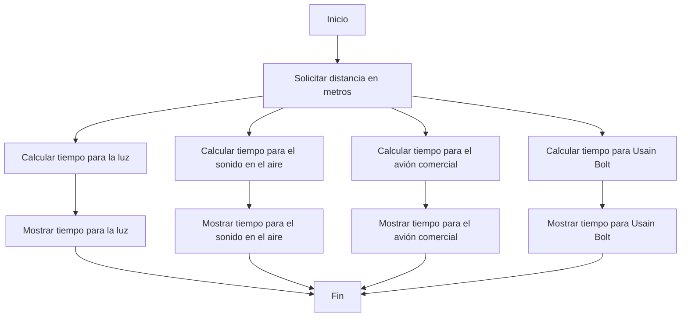

# Taller1
#  LOGO DE NUESTRO EQUIPO


#  1.El resultado de nuestro Python Beginner Quiz:


# 2. Realice un programa que lea tres números reales y determine cuál es el mayor.
```
n1 = int(input("ingrese el primer número"))
n2 = int(input("ingrese el segundo número"))
n3 = int(input("ingree el tercer número"))
if n1 and n1 > n3:
    print("El número mayor es: ",n1) 
elif n2 > n1 and n2 > n3:
    print("El número mayor es:",n2)
elif n3 > n1 and n3 > n2:
    print("El número mayor es: ",n3)
else:
    print("No se pudo establecer el mayor")
```


#  Diagrama de flujo / PUNTO 2


#  4. Realice un programa que lea dos números reales y determine si el primero es múltiplo del segundo.
```
numero1 = float(input("Ingrese el primer número: "))
numero2 = float(input("Ingrese el segundo número: "))

if numero2 == 0:
    print("No se puede determinar si un número es múltiplo de cero.")
else:
    if numero1 % numero2 == 0:
        print(f"{numero1} es múltiplo de {numero2}.")
    else:
        print(f"{numero1} no es múltiplo de {numero2}.")
```

#  6. Escriba un programa que solicite al usuario una letra y determine si es una vocal o una consonante
```
c = input("Ingresa una letra cualquiera: ")
vocales =  ['a', 'e', 'i', 'o', 'u', 'A', 'E', 'I', 'O', 'U']
if c in vocales:
    print("Es una vocal") 
else:     
    print("Es una consonante")
```

#  8. Escriba un programa al que se le ingrese la frecuencia de una onda en hz y como salida arroje en que parte del espectro electromagnético se encuentra.
```
frecuencia = float(input("Ingrese la frecuencia en Hertz (Hz): "))

radio = (3e2, 3e9)  # 300 Hz a 3 GHz
microondas = (3e9, 3e11)  # 3 GHz a 300 GHz
infrarrojo = (3e11, 4.3e14)  # 300 GHz a 430 THz
visible = (4.3e14, 7.5e14)  # 430 THz a 750 THz
ultravioleta = (7.5e14, 3e16)  # 750 THz a 30 PHz
rayos_x = (3e16, 3e18)  # 30 PHz a 3 EHz
rayos_gamma = (3e18, float('inf'))  # Más de 3 EHz

if radio[0] <= frecuencia <= radio[1]:
    print("La frecuencia está en la banda de las radiofrecuencias.")
elif microondas[0] <= frecuencia <= microondas[1]:
    print("La frecuencia está en la banda de las microondas.")
elif infrarrojo[0] <= frecuencia <= infrarrojo[1]:
    print("La frecuencia está en la banda de los infrarrojos.")
elif visible[0] <= frecuencia <= visible[1]:
    print("La frecuencia está en la banda de la luz visible.")
elif ultravioleta[0] <= frecuencia <= ultravioleta[1]:
    print("La frecuencia está en la banda de los ultravioletas.")
elif rayos_x[0] <= frecuencia <= rayos_x[1]:
    print("La frecuencia está en la banda de los rayos X.")
elif rayos_gamma[0] <= frecuencia:
    print("La frecuencia está en la banda de los rayos gamma.")
else:
    print("La frecuencia no se encuentra en ninguna banda conocida del espectro electromagnético.")
```

#  10. Escriba un programa que dada una distancia calcule:

El tiempo que le tomaría a la luz recorrer la distancia.
El tiempo que le tomaría al sonido (en el aire) recorrer la distancia.
El tiempo que le tomaría al vehiculo comercial más veloz recorrer la distancia.
El tiempo que le tomaría a Bolt recorrer la distancia.
```
velocidad_luz = 299792458  # Velocidad de la luz en el vacío
velocidad_sonido_aire = 343  # Velocidad del sonido en el aire a temperatura ambiente
velocidad_avion_comercial = 250  # Velocidad promedio de un avión comercial en m/s
velocidad_bolt = 12.42  # Velocidad máxima registrada de Usain Bolt en m/s

distancia = float(input("Ingrese la distancia en metros: "))

tiempo_luz = distancia / velocidad_luz
tiempo_sonido_aire = distancia / velocidad_sonido_aire
tiempo_avion_comercial = distancia / velocidad_avion_comercial
tiempo_bolt = distancia / velocidad_bolt

print(f"Tiempo que tomaría a la luz recorrer la distancia: {tiempo_luz:.6f} segundos")
print(f"Tiempo que tomaría al sonido en el aire recorrer la distancia: {tiempo_sonido_aire:.6f} segundos")
print(f"Tiempo que tomaría al vehículo comercial más veloz recorrer la distancia: {tiempo_avion_comercial:.6f} segundos")
print(f"Tiempo que tomaría a Usain Bolt recorrer la distancia: {tiempo_bolt:.6f} segundos")

```

# Diagrama de flujo / PUNTO 10




#  LINK Video
https://youtu.be/efxRk36vKps


#   gracias

